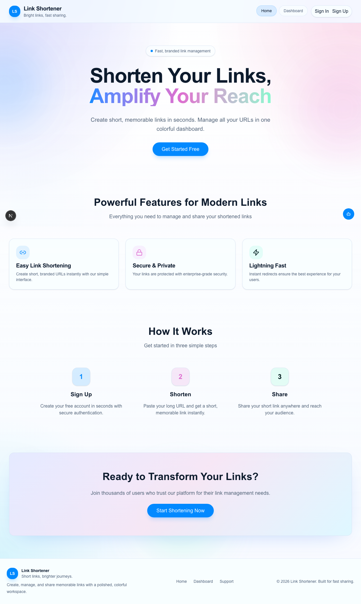
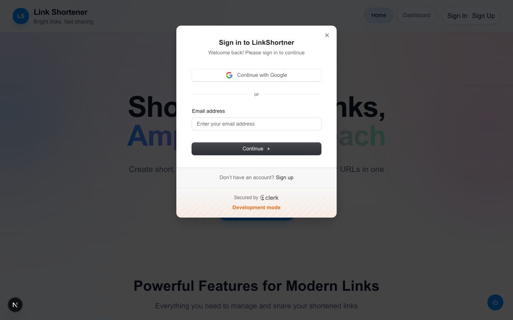
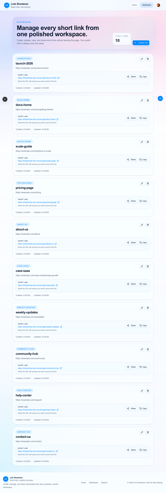
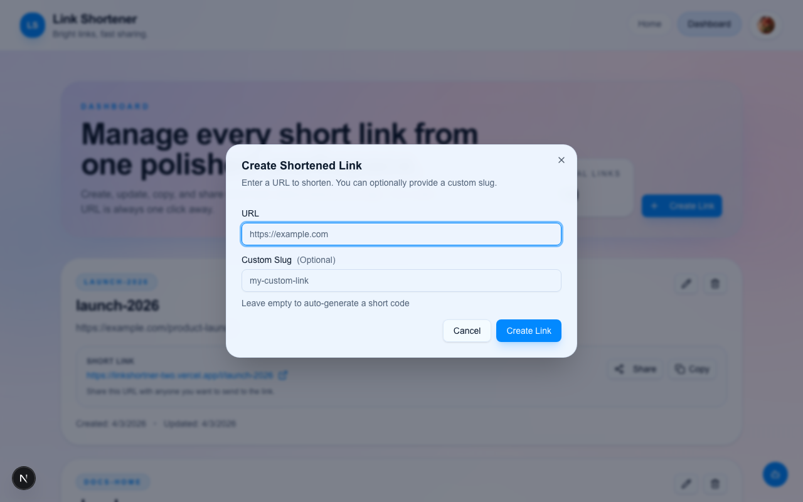
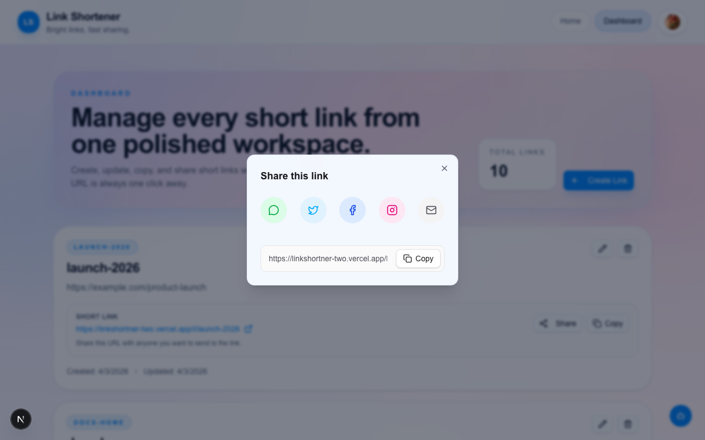

# Link Shortener


Live demo: https://linkshortner-two.vercel.app/

Link Shortener is a modern, full-stack URL management platform built for speed, clarity, and branded sharing. It pairs a high-converting public landing page with a secure dashboard so users can shorten links, organize them, and share them with confidence.

## Why It Stands Out

- A polished, colorful landing experience that feels ready for a real product launch
- Secure authentication with Clerk and protected user-specific dashboards
- Fast short-link creation with optional custom slugs for branded campaigns
- One-click copy and direct redirect handling for frictionless sharing
- Server-side ownership checks so each user only manages their own links
- Built with production-minded Next.js, Drizzle, and Neon patterns

## Application Workflow

The application follows a simple, intuitive workflow from arrival to sharing.

> **Tip:** You can automatically regenerate these screenshots for your own documentation at any time using our built-in Playwright script: `npx playwright test tests/generate-screenshots.spec.ts`.

### 1. Landing Page
The journey begins on the public landing page, designed to convert visitors with clear calls-to-action and a feature-first hero section.


### 2. Authentication
A beautiful, secure, and seamless Sign-In and Sign-Up experience powered by Clerk to protect user links.


### 3. Dashboard
After authenticating securely via Clerk, users are greeted by their personal Dashboard. Here they can view total links, access existing short links, and launch the creation flow.


### 4. Create Short Link
Clicking "Create Link" opens a streamlined modal where users paste their long URL and optionally specify a memorable custom slug for branding.


### 5. Share Anywhere
Once a link is created, the newly integrated "Share" feature allows users to instantly distribute their links via WhatsApp, X (Twitter), Facebook, Instagram, Email, or Native Mobile Share depending on their device.


## Product Tour

1. Open the public landing page and scan the feature-first hero.
2. Sign up or sign in with Clerk.
3. Create a short link from the dashboard.
4. Use a custom slug when you want a memorable branded URL.
5. Copy the generated link and share it anywhere.
6. Visit `/l/[shortcode]` to redirect instantly to the destination URL.

## Feature Highlights

- **Landing page that sells the product.** The homepage uses bold typography, layered gradients, and clear calls to action to turn visitors into sign-ups.
- **Dashboard built for speed.** Authenticated users can create, update, copy, and delete links from one tidy workspace.
- **Custom slugs on demand.** Create memorable URLs for campaigns, clients, and social sharing.
- **Instant sharing tools.** Every created link comes with a ready-to-copy short URL and a direct launch path.
- **Share anywhere.** Generate native sharing intents for WhatsApp, X (Twitter), Facebook, Email, and clipboard fallbacks with Web Share API support for mobile.
- **Reliable redirects.** The `/l/[shortcode]` route resolves the original destination on the server and sends users there immediately.
- **Ownership-aware data model.** Links are stored per user and guarded by server-side checks before updates or deletes.

## Testing & Security

This project enforces high code quality and security standards through:
- **Unit Testing:** Jest and React Testing Library are configured to test components and utility functions.
- **Security Linting:** ESLint is enhanced with `eslint-plugin-security` to statically detect vulnerabilities during development.
- **Continuous Integration (CI):** GitHub Action workflows automatically run linting, unit tests, and dependency security audits on every push to the `main` branch.

## Tech Stack

- Next.js 16 App Router
- React 19
- TypeScript
- PostgreSQL with Neon serverless
- Drizzle ORM
- Clerk authentication
- Tailwind CSS v4

## Getting Started

### Prerequisites

- Node.js 20+
- npm
- A PostgreSQL database
- Clerk application keys

### Environment Variables

Create a `.env.local` file with:

```bash
DATABASE_URL="your-neon-postgres-connection-string"
NEXT_PUBLIC_CLERK_PUBLISHABLE_KEY="your-clerk-publishable-key"
CLERK_SECRET_KEY="your-clerk-secret-key"
```

### Install Dependencies

```bash
npm install
```

### Run Locally

```bash
npm run dev
```

Open `http://localhost:3000`.

## Available Scripts

- `npm run dev` - start the development server
- `npm run build` - build for production
- `npm run start` - start the production server
- `npm run lint` - run ESLint
- `npm run test` - run the test suite
- `npx playwright test` - run end-to-end tests and generate screenshots
- `npm run seed:links` - seed sample links

## Project Structure

- `app/` - Next.js routes, layouts, and server actions
- `components/` - shared UI components
- `data/` - database access helpers
- `docs/` - project standards and upgrade notes
- `public/readme/` - marketing preview assets used in this README

## Notes

- The dashboard is only available to signed-in users.
- Short links redirect through `/l/[shortcode]`.
- Link ownership is enforced on the server.
